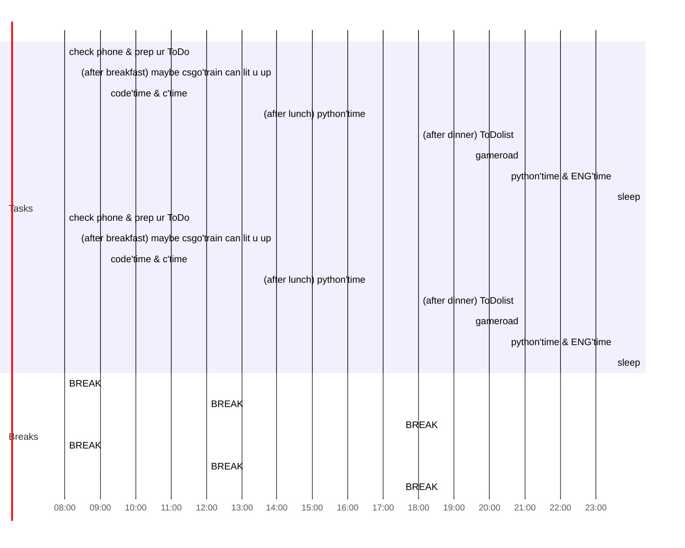

## MON

### Morning prep

- [ ] 08:00 check phone & prep ur ToDo
- [ ] 08:10 
- [ ] 08:20 (after breakfast) maybe csgo'train can lit u up
- [ ] 09:10 code'time & c'time
- [ ] 12:00 BREAK
- [ ] 13:30 (after lunch) python'time
- [ ] 17:30 BREAK
- [ ] 18:00 (after dinner) ToDolist
- [ ] 19:30 gameroad
- [ ] 20:30 python'time & ENG'time
- [ ] 23:30 sleep

